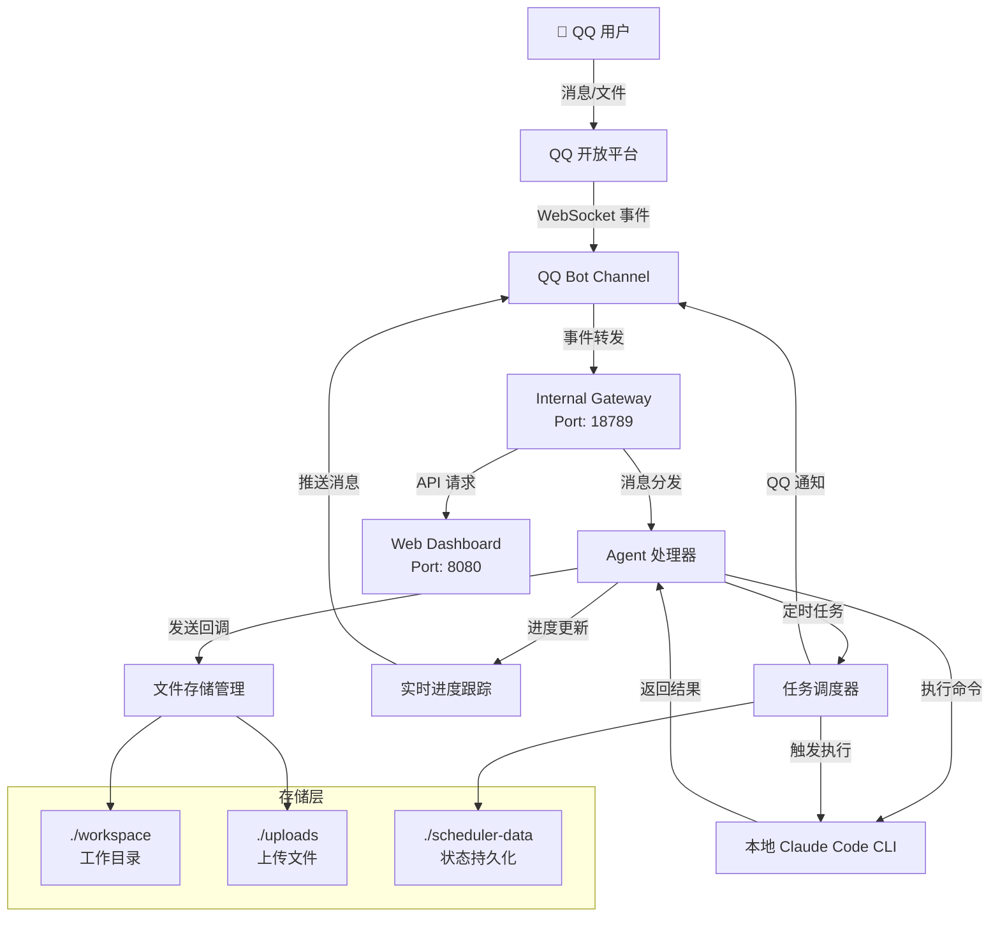

# QQ-Claude-Proxy

<div align="center">


### [本地 Claude Code] + [QQ 远程控制] = 你的移动 AI 工作站

通过手机 QQ 远程控制本地安装的 Claude Code CLI，让 AI 助手随身边随行。

**核心差异**: 与其他云端 AI 平台不同，本项目运行的是**你本地安装的 Claude Code CLI**，
这意味着：

*   所有指令、工具和配置都沿用自己的 Claude Code 设置
*   支持你自定义的所有 Skills 和 MCP 插件
*   完全本地执行，无需上传代码到云端
*   一次安装，终身使用，不受云端服务限制

[快速开始](#快速开始) | [功能特性](#功能特性) | [配置说明](#配置说明) | [使用指南](#使用指南)

</div>

---

## 📸 演示截图

### QQ 端实时交互

<table>
<tr>
<td width="33%"></td>
<td width="33%"></td>
<td width="33%"></td>
</tr>
<tr>
<td align="center">手机 QQ 对话</td>
<td align="center">工具执行状态</td>
<td align="center">文件传输</td>
</tr>
</table>

---

## 功能特性

### 核心

*   **[QQ Bot 集成](#qq-bot-集成)** - 通过手机 QQ 发送消息与 Claude Code CLI 交互
*   **本地 CLI 执行** - 直接运行电脑端的 `claude` 命令行工具，使用你自己的配置和插件
*   **文件双向传输** - 手机 QQ 与电脑互传文件，自动处理图片和文档

### 监控

*   **Web Dashboard** - 精美的 Web 界面 (http://localhost:8080) 实时监控任务状态
*   **实时进度跟踪** - VS Code 风格的任务进度展示，支持工具使用实时显示
*   **定时任务调度** - 支持周期任务和定时任务，QQ 通知执行结果

### 运维

*   **自动重启** - 支持通过 Dashboard 一键重启服务
*   **端口自动清理** - 启动时自动清理被占用的端口
*   **状态持久化** - 自动保存和恢复任务状态
*   **权限控制** - 支持用户白名单限制访问

---

## 快速开始

### 1. 安装依赖

```bash
git clone https://github.com/VAAN0524/QQ-Claude-Proxy.git
cd QQ-Claude-Proxy
npm install
```

### 2. 安装 Claude Code CLI

**这是本项目的核心依赖**，必须先安装并登录：

```bash
# 全局安装 Claude Code CLI
npm install -g @anthropic-ai/claude-code

# 登录你的 Anthropic 账户
claude
```

> **注意**: Claude Code CLI 使用你本地安装的配置，包括：
> - `~/.claude/` 下的自定义 Skills
> - `~/.claude/` 下的 MCP 插件配置
> - 你个人的 API Key 和使用配额

### 3. 配置 QQ Bot

1. 访问 [QQ 开放平台](https://q.qq.com/) 注册开发者账号
2. 创建机器人应用，获取 **AppID** 和 **AppSecret**
3. 配置沙箱用户（添加你的 QQ 号）
4. 用手机 QQ 扫码添加机器人

复制环境变量模板并编辑：

```bash
cp .env.example .env
```

编辑 `.env` 文件：

```env
# QQ Bot 配置 (从 QQ 开放平台获取)
QQ_BOT_APP_ID=your_app_id
QQ_BOT_SECRET=your_app_secret

# 可选：用户白名单 (逗号分隔的 OpenID)
# ALLOWED_USERS=
```

### 4. 运行服务

**开发模式** (支持热重载):

```bash
npm run dev
```

**生产模式**:

```bash
npm run build
npm start
```

**Windows 快捷启动**:

```batch
quick-start.bat
```

### 5. 访问 Dashboard

打开浏览器访问: **http://localhost:8080**

---

## 配置说明

### 环境变量 (.env)

| 变量 | 说明 | 必需 |
|------|------|------|
| `QQ_BOT_APP_ID` | QQ 机器人 AppID | 是 |
| `QQ_BOT_SECRET` | QQ 机器人 AppSecret | 是 |
| `ALLOWED_USERS` | 用户白名单 (逗号分隔的 OpenID) | 否 |

### 配置文件 (config.json)

```json
{
  "gateway": {
    "port": 18789,
    "host": "127.0.0.1"
  },
  "channels": {
    "qqbot": {
      "enabled": true,
      "appId": "",
      "clientSecret": "",
      "sandbox": true
    }
  },
  "agent": {
    "allowedUsers": [],
    "timeout": 300000
  },
  "storage": {
    "downloadPath": "./workspace",
    "uploadPath": "./uploads"
  },
  "scheduler": {
    "enabled": true,
    "storagePath": "./scheduler-data",
    "resultDir": "./scheduler-results"
  }
}
```

---

## 使用指南

### QQ 消息交互

通过手机 QQ，你可以：

*   **对话交互**: 直接发送消息与 Claude 对话
*   **发送图片**: 发送图片，Claude 会保存到工作区并读取
*   **发送文件**: 发送文件，Claude 会自动处理
*   **请求文件**: 让 Claude 生成文件并发送给你

**示例命令**:

```
帮我读取 package.json 文件
创建一个 hello.txt 文件，内容是 Hello World
分析这张图片 (附上图片)
把刚才生成的代码发给我
列出文件
清空历史
新任务
```

### Dashboard 功能

访问 **http://localhost:8080** 可以:

*   **实时监控**: 查看运行中的任务和进度
*   **定时任务**: 创建和管理周期/定时任务
*   **系统设置**: 修改配置并重启服务
*   **任务历史**: 查看已完成任务的历史记录

### 定时任务

支持两种类型的定时任务:

1.  **周期任务**: 按固定间隔重复执行 (如每天、每小时)
2.  **定时任务**: 在指定时间执行一次

**创建方式**:
*   通过 Dashboard 界面创建
*   直接编辑 `scheduler-data/tasks.json`

---

## 项目架构

### 系统架构图



### 数据流

```
┌─────────────────────────────────────────────────────────────────────┐
│                         QQ 消息处理流程                              │
├─────────────────────────────────────────────────────────────────────┤
│                                                                      │
│  ① 用户发送消息/文件                                                  │
│        ↓                                                             │
│  ② QQ Bot Channel 接收事件                                          │
│        ↓                                                             │
│  ③ Gateway 路由分发                                                 │
│        ↓                                                             │
│  ④ Agent 处理:                                                       │
│      - 权限检查 (allowedUsers)                                       │
│      - 文件下载 → uploads/                                           │
│      - 调用 Claude Code CLI                                          │
│        ↓                                                             │
│  ⑤ Claude 执行 (本地)                                                │
│      - 读取 workspace/ 文件                                          │
│      - 执行命令/工具                                                  │
│      - 生成新文件                                                     │
│        ↓                                                             │
│  ⑥ Agent 返回响应                                                    │
│      - 文件自动发送                                                   │
│      - 进度实时推送                                                   │
│        ↓                                                             │
│  ⑦ QQ Bot Channel 发送回用户                                         │
│                                                                      │
└─────────────────────────────────────────────────────────────────────┘
```

### 核心模块

```
QQ-Claude-Proxy/
├── 📂 src/                          # 源代码
│   ├── index.ts                     # 🔷 主入口
│   │
│   ├── 📂 gateway/                  # 🔶 WebSocket 消息网关
│   │   ├── server.ts                #    WS 服务器 (Port: 18789)
│   │   ├── protocol.ts              #    消息协议定义
│   │   ├── router.ts                #    消息路由分发
│   │   ├── session.ts               #    会话管理
│   │   ├── http-server.ts           #    HTTP 服务器 (Port: 8080)
│   │   ├── dashboard-api.ts         #    Dashboard REST API
│   │   └── dashboard-state-store.ts #    状态持久化
│   │
│   ├── 📂 channels/                 # 🔵 渠道适配器
│   │   └── qqbot/                   #    QQ Bot 适配器
│   │       ├── gateway.ts           #       QQ Gateway WebSocket
│   │       ├── api.ts               #       QQ HTTP API
│   │       ├── types.ts             #       类型定义
│   │       └── index.ts             #       主入口
│   │
│   ├── 📂 agent/                    # 🟢 Claude Code Agent
│   │   ├── index.ts                 #    Agent 主入口
│   │   ├── cli-session-manager.ts  #    CLI 会话管理 (队列化)
│   │   ├── progress-tracker.ts     #    实时进度跟踪
│   │   ├── file-storage.ts         #    文件下载/存储
│   │   ├── conversation-history.ts #    对话历史备份
│   │   └── tools.ts                 #    工具定义
│   │
│   ├── 📂 scheduler/                # 🟡 定时任务调度器
│   │   ├── scheduler.ts             #    调度器核心
│   │   ├── task-store.ts            #    任务存储
│   │   ├── task-runner.ts           #    任务执行器
│   │   └── types.ts                 #    类型定义
│   │
│   ├── 📂 config/                   # ⚙️ 配置管理
│   │   ├── index.ts                 #    配置加载器
│   │   └── schema.ts                #    配置 Schema
│   │
│   └── 📂 utils/                    # 🔧 工具函数
│       └── logger.ts                #    结构化日志
│
├── 📂 public/dashboard/              # 🌐 Dashboard 前端
│   ├── index.html                   #    主页面
│   ├── styles.css                   #    样式文件
│   └── app.js                       #    前端逻辑
│
├── 📂 workspace/                     # 📁 Claude 工作目录
├── 📂 uploads/                       # 📎 用户上传文件存储
│
├── start.bat                        # 🚀 启动脚本
├── quick-start.bat                  # ⚡ 快速启动
├── .env.example                     # 🔐 环境变量模板
└── README.md                        # 📖 项目文档
```

### 端口说明

| 端口 | 服务 | 说明 |
|:----:|------|------|
| 18789 | Gateway WebSocket | 内部消息总线，组件间通信 |
| 8080 | Dashboard HTTP | Web 管理界面 |

---

## 与其他平台的差异

| 特性 | QQ-Claude-Proxy | 云端 AI 平台 |
|------|----------------|-------------|
| **执行环境** | 本地 Claude Code CLI | 云端服务器 |
| **配置管理** | 沿用你自己的配置 | 平台预设配置 |
| **自定义 Skills** | 支持所有本地 Skills | 受限或不可用 |
| **MCP 插件** | 支持所有本地插件 | 受限或不可用 |
| **代码安全** | 完全本地执行 | 需上传到云端 |
| **使用成本** | 使用你自己的 API 配额 | 平台收费或受限 |
| **网络要求** | 仅 QQ 消息需要网络 | 完全依赖网络 |

---

## 安全注意事项

1.  **不要泄露凭证** - AppSecret 需要妥善保管，不要提交到 Git
2.  **设置用户白名单** - 限制谁可以使用你的机器人
3.  **Claude CLI 认证** - Claude CLI 使用本地认证，无需在代码中存储 API Key
4.  **定期审查日志** - 监控机器人的活动
5.  **端口安全** - Gateway 默认只监听 127.0.0.1，不对外暴露

---

## 常见问题

### Q: Claude Code CLI 没有安装会怎样?

A: 启动时会显示警告，但服务可以运行。当收到消息时会报错。

### Q: 如何获取 QQ 用户的 OpenID?

A: 用户首次发送消息后，可以在日志中看到其 OpenID。

### Q: 支持群聊吗?

A: 支持！机器人可以在私聊和群聊中使用。

### Q: 如何查看实时日志?

A: 服务运行时会输出结构化日志，包含任务进度和工具使用信息。

### Q: 定时任务失败会重试吗?

A: 周期任务默认会在失败后继续执行，可通过配置修改。

---

## 开发命令

```bash
# 开发模式 (热重载)
npm run dev

# 编译
npm run build

# 生产运行
npm start

# 类型检查
npm run typecheck

# 测试
npm test              # 运行所有测试
npm run test:watch    # 监视模式
npm run test:coverage # 覆盖率报告
```

---

## 许可证

MIT License

---

## 相关链接

*   [Claude Code CLI 官方文档](https://docs.anthropic.com/en/docs/claude-code)
*   [QQ 开放平台](https://q.qq.com/)
*   [GitHub 仓库](https://github.com/VAAN0524/QQ-Claude-Proxy)

---

<div align="center">

**Made with [Heart] by VAAN**

[GitHub](https://github.com/VAAN0524) | [Issues](https://github.com/VAAN0524/QQ-Claude-Proxy/issues) | [Star ⭐](https://github.com/VAAN0524/QQ-Claude-Proxy)

</div>
