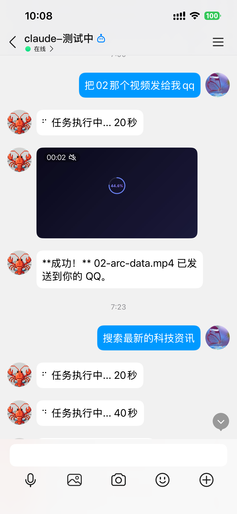
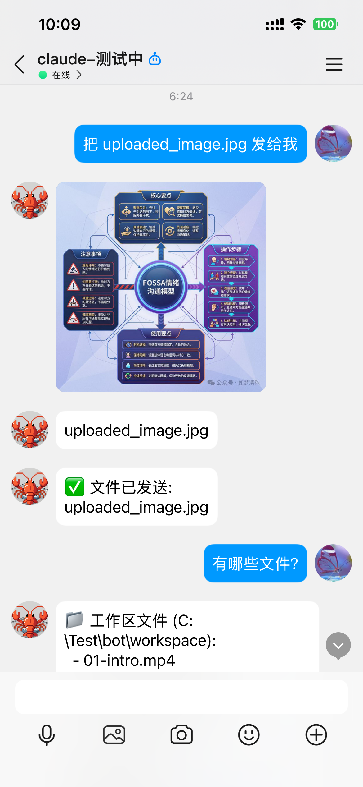
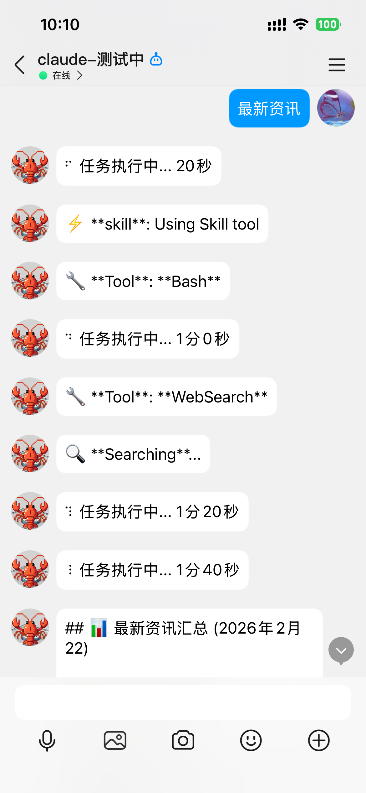
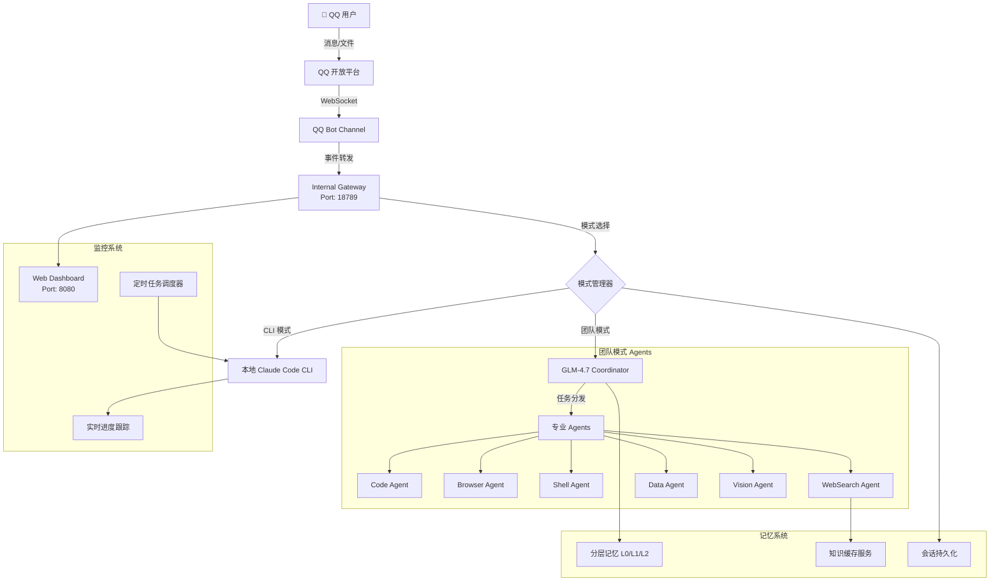

# 🤖 QQ-Claude-Proxy

<div align="center">


---

## 📱 手机 QQ → 控制 💻 本地 Claude Code CLI = 你的移动 AI 工作站

### 把你的电脑变成随身 AI 助手 - 随时随地，通过手机 QQ 控制

</div>

---

## ✨ 为什么选择 QQ-Claude-Proxy？

### 🎯 与众不同的核心优势

| 特性 | QQ-Claude-Proxy | 云端 AI 平台 |
|------|:----------------:|:-------------:|
| **执行环境** | 🏠 **本地运行** | ☁️ 云端服务器 |
| **数据安全** | 🔒 **代码不上传** | ⚠️ 需上传云端 |
| **配置自由** | ✅ **使用你自己的配置** | ❌ 平台预设配置 |
| **插件扩展** | 🧩 **支持所有 Skills/MCP** | ❌ 受限或不可用 |
| **使用成本** | 💰 **用自己的 API 配额** | 💸 平台收费或受限 |
| **网络要求** | 📶 **仅 QQ 消息需网络** | 🌐 完全依赖网络 |

---

## 🚀 核心功能一览

### 💪 强大的双模式系统

#### CLI 模式 - 直接调用本地 Claude Code
```
/mode cli
```
- 💻 **完整代码能力** - 使用你本地的 Claude Code CLI
- 🎨 **支持所有 Skills** - 自动加载 `~/.claude/skills/` 下的所有技能
- 🔌 **支持所有 MCP** - 兼容 `~/.claude/mcp_servers.json` 配置的插件
- 📁 **完整文件访问** - 读写 workspace 目录，处理项目文件

#### 团队模式 - GLM-4.7 智能多 Agent 协作
```
/mode team
```
- 🧠 **智能协调** - GLM-4.7 分析任务，自动分配给最佳 Agent
- 🤖 **5 个专业 Agent** - Code、Browser、Shell、WebSearch、Data 协作
- 🧠 **分层记忆** - L0/L1/L2 三层记忆架构，跨会话记忆共享
- 🧠 **知识缓存** - 自动缓存搜索结果，避免重复搜索

---

## 🎬 实际使用场景

### 场景 1: 紧急 Bug 修复
```
你 (地铁上): "帮我检查 backend/auth.ts 的第 45 行有个 bug"
Claude: [分析代码] "发现是 token 验证逻辑问题，已修复"
你: "把修复后的代码发给我"
Claude: [发送文件] ✅
```
**⏱️ 全程 3 分钟，无需打开电脑**

### 场景 2: 远程监控部署
```
你: "监控生产服务器日志，有错误立即告诉我"
Claude: [设置定时任务] "已设置每 5 分钟检查一次"
(30 分钟后)
Claude: [QQ 通知] "⚠️ 发现 3 个错误，已记录到日志"
```
**🔔 24 小时待命，随时汇报**

### 场景 3: 学习新技术
```
你: "什么是 React Server Components？"
Claude: [搜索 + 分析] 详细解释 + 代码示例
你: "创建一个示例项目"
Claude: [创建项目] ✅
你: "把项目发给我"
Claude: [发送 zip] ✅
```
**📚 边学边做，项目直接到手**

---

## 📊 项目规模

| 分类 | 文件数 | 代码行数 |
|------|-------|---------|
| **后端** (TypeScript) | 72 | **30,000+** |
| **前端** (HTML/CSS/JS) | 15 | 8,900 |
| **配置** (JSON) | 16 | 7,800 |
| **总计** | **103** | **~46,700** |

💡 **核心组件**:
- 🔷 LLM Provider 统一接口 (OpenAI/Anthropic/GLM)
- 🟢 8 个专业 Agents (Code/Browser/Shell/WebSearch/Data/Vision/Refactor/SkillManager)
- 🧠 分层记忆系统 (L0 快速记忆 / L1 短期记忆 / L2 长期记忆)
- 💾 知识缓存服务 (智能 TTL，避免重复搜索)
- 🔄 会话持久化 (服务重启后自动恢复)
- 📅 定时任务调度 (支持周期任务和定时任务)
- 🌐 Web Dashboard (http://localhost:8080)

---

## 📸 演示截图

<table>
<tr>
<td width="33%"></td>
<td width="33%"></td>
<td width="33%"></td>
</tr>
<tr>
<td align="center">视频文件传输</td>
<td align="center">图片分析</td>
<td align="center">实时工具状态</td>
</tr>
</table>

---

## 🚀 快速开始 (5 分钟上手)

### 1. 安装 Claude Code CLI ⭐ 必需
```bash
npm install -g @anthropic-ai/claude-code
claude  # 登录你的 Anthropic 账户
```

### 2. 安装本项目
```bash
git clone https://github.com/VAAN0524/QQ-Claude-Proxy.git
cd QQ-Claude-Proxy
npm install
```

### 3. 配置 QQ Bot
1. 访问 [QQ 开放平台](https://q.qq.com/) 注册并创建机器人
2. 获取 **AppID** 和 **AppSecret**
3. 配置沙箱用户（添加你的 QQ 号）
4. 用手机 QQ 扫码添加机器人

```bash
cp .env.example .env
# 编辑 .env，填入 QQ_BOT_APP_ID 和 QQ_BOT_SECRET
```

### 4. 启动服务
```bash
npm run dev  # 开发模式
# 或
quick-start.bat  # Windows 一键启动
```

### 5. 访问 Dashboard
打开浏览器访问 **http://localhost:8080**

---

## 🎮 使用指南

### 模式切换
```
/mode cli      # CLI 模式 - 使用本地 Claude Code
/mode team     # 团队模式 - 使用多 Agent 协作
```

### QQ 常用命令
```
列出文件              # 查看工作区文件
把 xxx.md 发给我      # 发送文件到 QQ
清空历史              # 重置对话
新任务                # 开始新任务
创建任务              # 创建定时任务 (团队模式)
```

### Dashboard 功能
- 📊 **实时监控** - 任务进度、工具使用、Agent 状态
- 🤖 **Agent 管理** - 查看 8 个 Agents 的详细信息
- 📅 **定时任务** - 创建周期任务和定时任务
- 📝 **日志查看** - 实时日志，支持过滤和搜索
- ⚙️ **系统配置** - 在线修改配置并重启服务

---

## 🏗️ 项目架构



---

## 🔥 最新更新 (v1.3.0)

### ✨ 新增功能

- **🧠 知识缓存服务** - 智能缓存搜索结果，避免重复搜索
  - 根据查询类型自动设置 TTL（天气 30 分钟、定义 7 天、API 文档 30 天）
  - 缓存命中时显示 `[缓存答案]` 标记

- **💾 会话持久化** - 每个用户/群组独立会话
  - 服务重启后自动恢复对话历史
  - 支持 `user_{userId}` 和 `group_{groupId}` 隔离

- **🎯 系统提示词优化** - 添加记忆利用指导
  - 明确告诉 LLM 优先使用历史记忆
  - 添加记忆利用示例和禁止行为说明

### 🔧 技术改进

- GLMCoordinatorAgent 支持动态获取会话上下文
- `web_search` 和 `run_websearch_agent` 集成缓存机制
- 新增 `KnowledgeCache` 服务 (`src/agents/memory/KnowledgeCache.ts`)

---

## 📂 核心目录结构

```
QQ-Claude-Proxy/
├── src/
│   ├── agents/                 # 🤖 多 Agent 系统
│   │   ├── memory/            # 🧠 记忆系统 (分层记忆 + 知识缓存)
│   │   ├── learning/          # 📚 自主学习模块
│   │   └── tools/             # 🔧 Agent 工具分类
│   ├── gateway/              # 🔶 WebSocket 消息网关
│   ├── channels/             # 🔵 QQ Bot Channel
│   ├── llm/                  # 🔷 LLM Provider (OpenAI/Anthropic/GLM)
│   ├── terminal/             # 🟠 终端监控与 Diff 渲染
│   ├── scheduler/            # 🟡 定时任务调度器
│   └── config/               # ⚙️ 配置管理
├── public/dashboard/         # 🌐 Web Dashboard
├── skills/                   # 📚 技能目录
├── workspace/                # 📁 Claude 工作目录
└── uploads/                  # 📎 用户上传文件
```

---

## 🛡️ 安全注意事项

1. 🔐 **保护 AppSecret** - 不要提交到 Git，使用 `.env` 文件
2. 👥 **设置用户白名单** - 限制谁可以使用你的机器人
3. 📍 **端口安全** - Gateway 默认只监听 `127.0.0.1`
4. 📝 **定期审查日志** - 监控机器人的活动

---

## 📖 常见问题

### Q: 和云端 AI 平台有什么区别？
**A:** 核心区别是**执行环境**。本项目运行的是**你本地安装的 Claude Code CLI**，使用你自己的配置、Skills 和 MCP 插件，代码完全本地执行，不需要上传到云端。

### Q: 支持群聊吗？
**A:** 支持！机器人可以在私聊和群聊中使用，每个群组有独立的会话和记忆。

### Q: 搜索结果会缓存吗？
**A:** 是的！智能缓存系统会根据查询类型自动设置有效期，避免重复搜索同样的问题。

### Q: 服务重启后会丢失对话历史吗？
**A:** 不会！会话持久化系统会自动保存和恢复对话历史。

---

## 🔗 相关链接

- [Claude Code CLI 官方文档](https://docs.anthropic.com/en/docs/claude-code)
- [QQ 开放平台](https://q.qq.com/)
- [GitHub 仓库](https://github.com/VAAN0524/QQ-Claude-Proxy)
- [问题反馈](https://github.com/VAAN0524/QQ-Claude-Proxy/issues)

---

<div align="center">

## ⭐ Star this project if you find it helpful!

**Made with [Heart] by VAAN**

[GitHub](https://github.com/VAAN0524) | [Issues](https://github.com/VAAN0524/QQ-Claude-Proxy/issues) | [Star ⭐](https://github.com/VAAN0524/QQ-Claude-Proxy)

</div>
